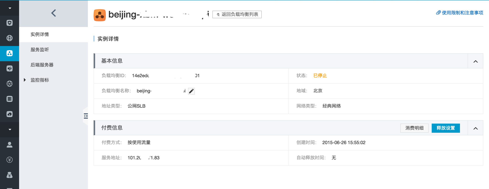
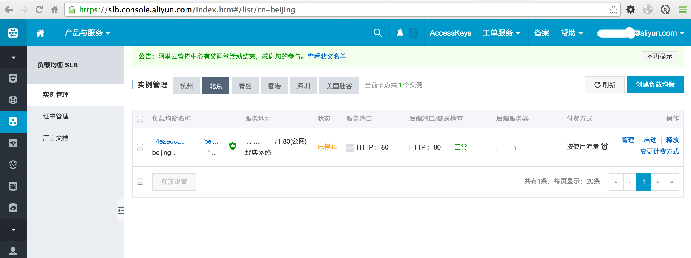
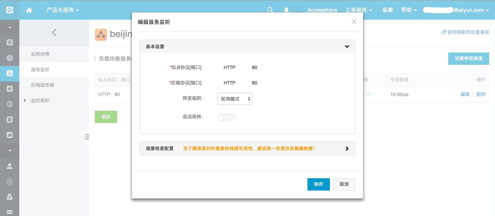
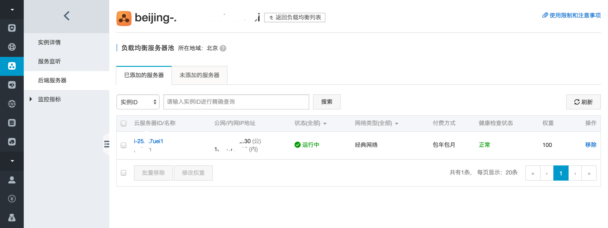
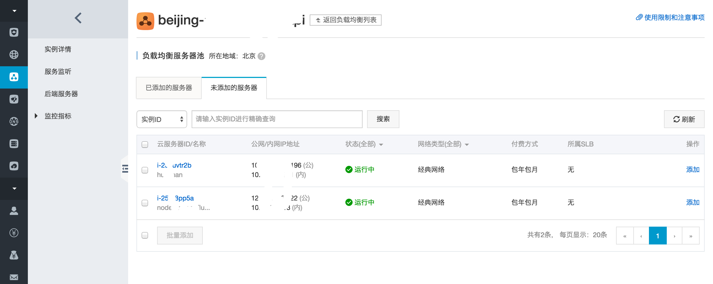
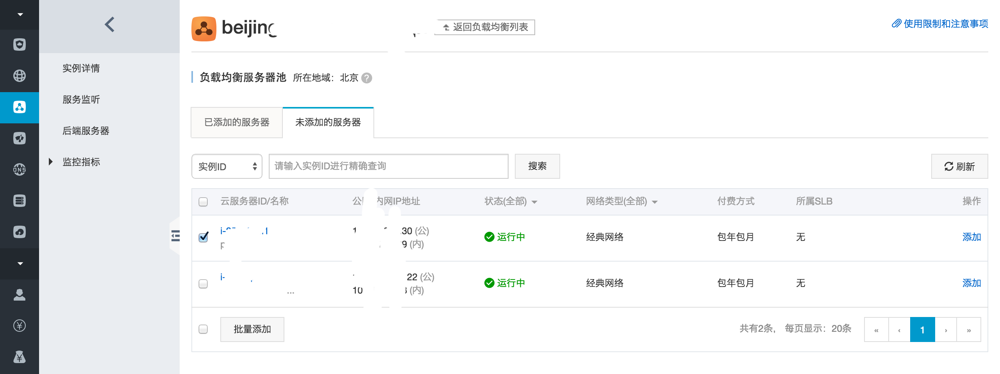
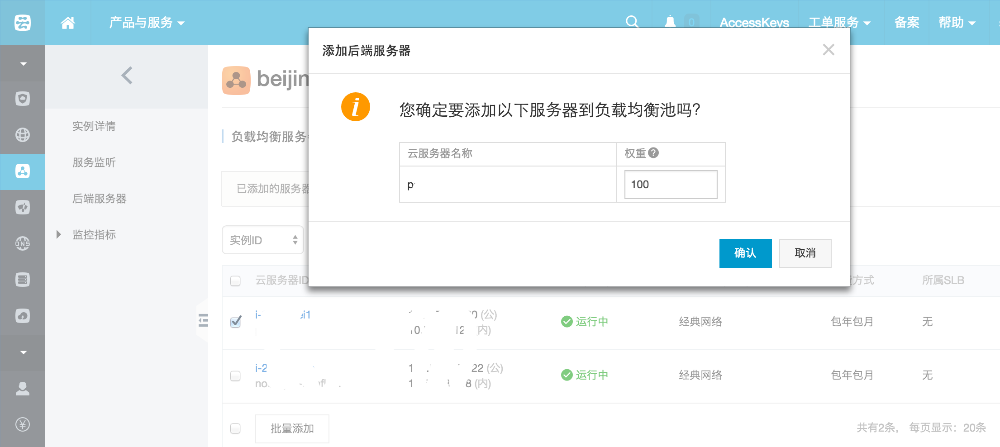
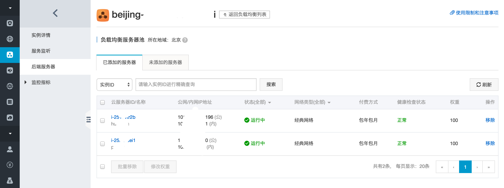

线上环境是阿里云，既然阿里云有SLB，比自己运维一个要省事儿的多，事实上，自己做也真不一定做得比它好，本节试图以haproxy来解释一下slb的原理

讲解haproxy的目的是介绍负载算法，便于理解SLB

## 目前比较流行的

目前，在线上环境中应用较多的负载均衡器硬件有F5 BIG-IP,软件有LVS，Nginx及HAProxy,高可用软件有Heartbeat. Keepalived

成熟的架构有

- LVS+Keepalived
- Nginx+Keepalived
- HAProxy+keepalived
- DRBD+Heartbeat

## HAProxy

优点

1. HAProxy是支持虚拟主机的，可以工作在4. 7层(支持多网段)；
2. 能够补充Nginx的一些缺点比如Session的保持，Cookie的引导等工作；
3. 支持url检测后端的服务器；
4. 它跟LVS一样，本身仅仅就只是一款负载均衡软件；单纯从效率上来讲HAProxy更会比Nginx有更出色的负载均衡速度，在并发处理上也是优于Nginx的；
5. HAProxy可以对Mysql读进行负载均衡，对后端的MySQL节点进行检测和负载均衡，不过在后端的MySQL slaves数量超过10台时性能不如LVS；
6. HAProxy的算法较多，达到8种；

官网 http://www.haproxy.org/ (自备梯子)

- http://cbonte.github.io/haproxy-dconv/configuration-1.5.html
- http://demo.haproxy.org/

我觉得它是所有负载软件里最简单最好用的。配置文件比nginx还简单，而且还有监控页面。

下载最新版软件 http://www.haproxy.org/download/1.5/src/haproxy-1.5.12.tar.gz

解压

    tar -zxvf haproxy-1.5.12.tar.gz
    
切换到目录

    cd haproxy-1.5.12 
    
打开readme看一下，如何安装

    make TARGET=linux26
    sudo make install

## 创建一个配置文件

    # Simple configuration for an HTTP proxy listening on port 80 on all
    # interfaces and forwarding requests to a single backend "servers" with a
    # single server "server1" listening on 127.0.0.1:8000
    global
        daemon
        maxconn 256

    defaults
        mode http
        timeout connect 5000ms
        timeout client 50000ms
        timeout server 50000ms

    frontend http-in
        bind *:80
        default_backend servers

    backend servers
        server server1 127.0.0.1:8000 maxconn 32

    # The same configuration defined with a single listen block. Shorter but
    # less expressive, especially in HTTP mode.
    global
        daemon
        maxconn 256

    defaults
        mode http
        timeout connect 5000ms
        timeout client 50000ms
        timeout server 50000ms

    listen http-in
        bind *:80
        server server1 127.0.0.1:8000 maxconn 32

## 启动

    haproxy -f test.cfg

## 查看状态

记得在配置文件里加上

    listen admin_stats
        bind 0.0.0.0:8888
        stats refresh 30s
        stats uri /stats
        stats realm Haproxy Manager
        stats auth admin:admin
        #stats hide-version

http://ip:8888/stats

## 负载均衡--调度算法

HAProxy的算法有如下8种：

- roundrobin，表示简单的轮询，这个不多说，这个是 负载均衡 基本都具备的；
-  static-rr，表示根据权重，建议关注；
- leastconn，表示最少连接者先处理，建议关注；
- source，表示根据请求源IP，建议关注；
- uri，表示根据请求的URI；
- url_param，表示根据请求的URl参数'balance url_param' requires an URL parameter name
- hdr(name)，表示根据HTTP请求头来锁定每一次HTTP请求；
- rdp-cookie(name)，表示根据据cookie(name)来锁定并哈希每一次TCP请求。

## SLB

负载均衡（Server Load Balancer，简称SLB）是对多台云服务器进行流量分发的负载均衡服务。SLB可以通过流量分发扩展应用系统对外的服务能力，通过消除单点故障提升应用系统的可用性

## SLB是如何实现的

使用tengine实现的。

Tengine是由淘宝网发起的Web服务器项目。它在Nginx的基础上，针对大访问量网站的需求，添加了很多高级功能和特性。

see http://tengine.taobao.org/ 

## SLB用法

创建slb

点击管理按钮，进入实例详情

没啥需要改的，我们直接看服务监听功能，看看如何配置slb

- 配置端口
- 转发规则 
- 带宽
- 健康检查等

点击编辑按钮，此时可以看到具体配置页面

目前slb支持2种转发规则

- 轮询
- 最小连接数

轮询应该是和haproxy的roundrobin调度算法一样，表示简单的轮询

最小连接数SLB会自动判断 当前ECS 的established 来判断是否转发

配置完了slb server，下一步要设置具体slb把请求转发给哪台机器，这实际上才是最核心的的配置。

阿里云把这件事儿做的超级简单

假设我现在有一个ecs服务器为已填加

点击【未添加的服务器】，此时会列出未加入负载池的ecs服务器 

选中一台服务器

点击批量添加

配置一下权重，如果机器性能一样就配置权重一样，性能越好，权重越大

可选值【0 -- 100】

完成配置后，已添加服务器里就有了2台服务器

保证你的服务器都启动，比如2台服务器的80端口都正常即可

此时你需要做的是把你的域名解析到slb服务器的ip地址上

## 妙用

1台服务器绑定多个域名

- api.runkoa.com
- admin.runkoa.com
- h5.runkoa.com

## 总结

- 首先介绍了haproxy和负载均衡算法
- 介绍了阿里云slb用法
