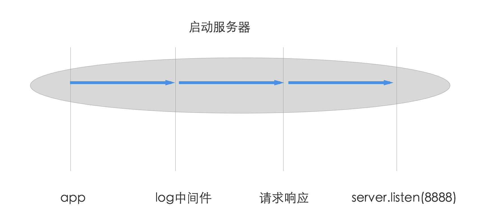
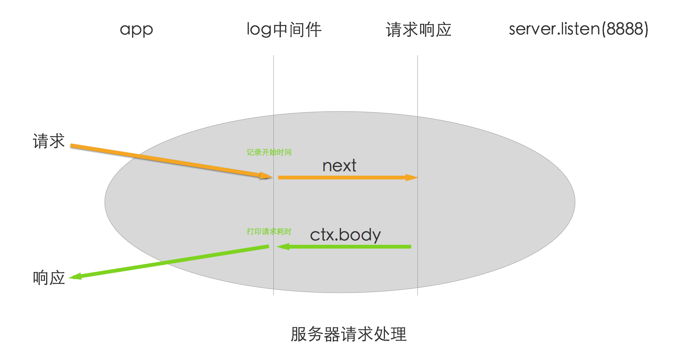
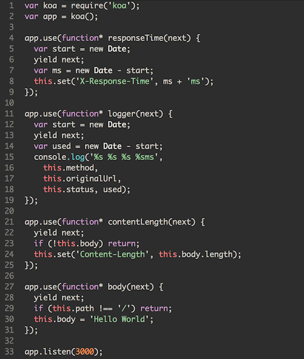

# 中间件

- 什么是中间件（1.x 和 2.x）
- 理解回形针原理
- 理解中间件原理，co + compose + convert源码解读
- 如何自定义中间件？
- 常用中间件

## 从最简单的http server开始

```
var http = require('http');

http.createServer(function(request,response){
    console.log(request);
    response.end('Hello world!');
}).listen(8888);
```

这就是最简单的实现

如果要是根据不同url去处理呢？

```
var http = require('http');

http.createServer(function(req, res){
    console.log(req);

    if(req.url =='/'){
      res.end('Hello world!');
    }else if(req.url =='/2'){
      res.end('Hello world!2');
    }else{
      res.end('Hello world! other');
    }
}).listen(8888);
```

如果成百上千、甚至更多http服务呢？这样写起来是不是太low了，肯定要封装一下，让它更简单。

Express框架的底层Connect就是这样的一个框架，Koa实际上也提供类似机制，下面我们看一下

我们用http和koa 1.x写一个同样功能的demo

```
var http = require('http');
var koa = require('koa');
var app = koa();
      
app.use(function *(next){
  if(this.url =='/'){
    this.body = 'Hello world!'
  }else if(this.url =='/2'){
    this.body = 'Hello world!2'
  }else{
    this.body = 'Hello world! other'
  }
})

var server = http.createServer(app.callback());

server.listen(8888);
```

对比一下，koa的demo里

```
http.createServer(app.callback())
```

和http示例里的

```
http.createServer(function(req, res){
    console.log(req);

    if(req.url =='/'){
      res.end('Hello world!');
    }else if(req.url =='/2'){
      res.end('Hello world!2');
    }else{
      res.end('Hello world! other');
    }
})
```

很明显，koa把http.createServer里的内容给封装到`app.callback()`里了。

那么`app.callback()`里到底有啥呢？

- app是koa对象
- app.use里使用generator函数
- app.callback()把app.use里的内容转成`function(req, res){...}`

给出服务器启动流程图



看到此处，你是否能够理解什么是中间件了呢？

## 什么是中间件？

> 中间件是Application提供请求处理的扩展机制，主要抽象HTTP协议里的request、response

如果把一个http处理过程比作是污水处理，中间件就像是一层层的过滤网。每个中间件在http处理过程中通过改写request或（和）response的数据、状态，实现了特定的功能。

http协议是无状态协议，所以http请求的过程可以这样理解，请求（request）过来，经过无数中间件拦截，直至响应（response）为止。

## Koa 中间件

Koa目前主要分1.x版本和2.x版本，它们最主要的差异就在于中间件的写法，本小节会一一举例，并最后对比它们的异同，以便后面章节的源码分析。

### 日志中间件



请求到达服务器后，依次经过各个中间件，直至被响应，所以整个流程

- 请求到达log中间件，记录此时的时间
- 放过，执行next
- 执行到响应中间件，返回ctx.body
- 回到log中间件，根据当前时间，打印请求耗时
- 把响应写到浏览器里

### 1.x 

```
var koa = require('koa');
var app = koa();

// logger

app.use(function *(next){
  var start = new Date;
  yield next;
  var ms = new Date - start;
  console.log('%s %s - %s', this.method, this.url, ms);
});

// response

app.use(function *(){
  this.body = 'Hello World';
});

app.listen(3000);
```

### 2.x

Koa 2.x是一个现代的中间件框架，它支持3种不同类型函数的中间件：

- common function 最常见的，也称modern middleware
- generatorFunction 生成器函数，就是`yield *`那个
- async function 最潮的es7 stage-3特性 async 函数，异步终极大杀器

#### common function
 
先看一下common function

```
const Koa = require('koa');
const app = new Koa();

// logger

app.use((ctx, next) => {
  const start = new Date();
  return next().then(() => {
    const ms = new Date() - start;
    console.log(`${ctx.method} ${ctx.url} - ${ms}ms`);
  });
});

// response
app.use(ctx => {
  ctx.body = 'Hello Koa';
});

app.listen(3000);
```

中间件定义

```
(ctx, next) => {
  
}

等同于

function (ctx, next){

}
```

和1.x相比较

- 这是普通的函数，不是generator函数。
- 2.x中间件的参数是2个，而1.x是1个，主要是上下文在2.x里显示声明了。可以简单的理解1.x里的this就是2.x里的ctx，它们的api是一模一样的。
- 2.x中间件内部，使用promise处理，而1.x是通过yield处理

它不限于Node.js版本，只要4.x以上都可以（Koa 2.x的中间件最终还是会转成generator），而且是支持Promise，所以整体来说，这种方式是最容易上手的，难度系数是3种中间件里最低的。如果有express经验，可以考虑从这种方式入手，学起来更简单。


#### generatorFunction

Koa设计初衷就是基于generator来构建更好的流程控制的web框架，所以在Koa 2.x里也支持generator，但和1.x稍有不同，先看代码，稍后会解释。

```
const Koa = require('koa');
const app = new Koa();

// logger

app.use(co.wrap(function *(ctx, next) {
  const start = new Date();
  yield next();
  const ms = new Date() - start;
  console.log(`${ctx.method} ${ctx.url} - ${ms}ms`);
}));

// response
app.use(ctx => {
  ctx.body = 'Hello Koa';
});

app.listen(3000);
```

对比1.x

- 2.x中间件generatorFunction被co.wrap包裹了，被转换成function *(){}
- 2.x中间件generatorFunction的参数多了ctx，和上面common function说的一样，上下文ctx被显示声明了，统一写法
- 2.x中间件generatorFunction的跳到下一个中间件是`yield next();`，而不是1.x用的`yield next;`

它和上面common function一样，不限于Node.js版本，只要4.x以上都可以（Koa 2.x的中间件最终还是会转成generator），2.x中间件generatorFunction这种方式是唯一和Koa 1.x最像的方式，可以说是从1.x迁移到2.x的最佳手段。

同样是generator的好处是，可以在generator里进行yieldable操作，对于熟悉1.x的读者来说，是非常好的。

还得爽爽的yieldable么？

#### async函数

Koa 之所以从1.x升级到2.x，可以说async函数居功不小。async函数是es7里stage-3里的特性，可以非常好的解决异步问题，相当于更高级的generator（注：babel或regenerator就是用generator实现的async）。

async函数的好处

- 无需执行器
- await直接异步Promise方法

下面给出async函数中间件用法

```
const Koa = require('koa');
const app = new Koa();

// logger

app.use(async (ctx, next) => {
  const start = new Date();
  await next();
  const ms = new Date() - start;
  console.log(`${ctx.method} ${ctx.url} - ${ms}ms`);
});

// response
app.use(ctx => {
  ctx.body = 'Hello Koa';
});

app.listen(3000);
```

对比一下

- async函数除了多一个async关键字外，和普通函数无异，同样支持箭头函数（generator是不支持箭头函数写法的）。
- 与asynch函数搭配的await通过对接promise方法，没有yield的Yieldable强大，但也足够用的
- 2.x中间件async函数跳到下一个中间件是`await next();`，和commonfunction里的`return next()`类似

总结一下，从形式讲，async函数无疑是所有中间件中最耀眼的那个，语言清楚，简洁，结合await关键字，可以非常好的正好Promise资源。它虽好，可是执行的时候却很麻烦，目前Node.js里还没有原生支持async函数，所以只能借助于babel这样编译器工具来完成代码转换。

Koa 2.x迟迟没有发布2.0正式版原因就是Node.js没有原生支持async函数，但我们都非常期待使用这样好的特性。目前Chrome已经实现了async函数，所以Node.js实现async函数也会非常快的，预计是10月份之前，只要性能不是太差，大家都切过去吧。

### 为啥2.x要多出个ctx？

[@jonathanong](https://github.com/koajs/koa/issues/615)

这样变化的最主要的原因是，在你写koa apps 时使用async箭头函数的时候：

```
app.use(async (ctx, next) => {
  await next()
})
```
  
这种情况下，使用this是万万不可能的。

因为 Arrow Function是 Lexical scoping（定义时绑定）, this指向定义Arrow Function时外围, 而不是运行时的对象。

### 引用koa的差异

1.x

```
var koa = require('koa');
var app = koa();
```

2.x

```
const Koa = require('koa');
const app = new Koa();

```

源码

1.x

```
/**
 * Application prototype.
 */

var app = Application.prototype;

/**
 * Expose `Application`.
 */

module.exports = Application;

/**
 * Initialize a new `Application`.
 *
 * @api public
 */

function Application() {
  if (!(this instanceof Application)) return new Application;
  this.env = process.env.NODE_ENV || 'development';
  this.subdomainOffset = 2;
  this.middleware = [];
  this.proxy = false;
  this.context = Object.create(context);
  this.request = Object.create(request);
  this.response = Object.create(response);
}
```

2.x

```

/**
 * Expose `Application` class.
 * Inherits from `Emitter.prototype`.
 */

module.exports = class Application extends Emitter {

  /**
   * Initialize a new `Application`.
   *
   * @api public
   */

  constructor() {
    super();

    this.proxy = false;
    this.middleware = [];
    this.subdomainOffset = 2;
    this.env = process.env.NODE_ENV || 'development';
    this.context = Object.create(context);
    this.request = Object.create(request);
    this.response = Object.create(response);
  }
}
```

很明显，1.x是函数，而2.x是类，需要new来实例化。

整个Koa2.x里只有application做了类化，其他的还是保持之前的风格，大概还没有到必须修改的时候吧。

## 实例与原理 


看一下解析流程



## 理解回形针

https://github.com/koajs/convert/blob/master/test.js

```
describe('convert.compose()', () => {
  it('should work', () => {
    let call = []
    let context = {}
    let _context
    let mw = convert.compose([
      function * name (next) {
        call.push(1)
        yield next
        call.push(11)
      },
      (ctx, next) => {
        call.push(2)
        return next().then(() => {
          call.push(10)
        })
      },
      function * (next) {
        call.push(3)
        yield* next
        call.push(9)
      },
      co.wrap(function * (ctx, next) {
        call.push(4)
        yield next()
        call.push(8)
      }),
      function * (next) {
        try {
          call.push(5)
          yield next
        } catch (e) {
          call.push(7)
        }
      },
      (ctx, next) => {
        _context = ctx
        call.push(6)
        throw new Error()
      }
    ])

    return mw(context).then(() => {
      assert.equal(context, _context)
      assert.deepEqual(call, [1, 2, 3, 4, 5, 6, 7, 8, 9, 10, 11])
    })
  })
  ```
  

## 回形针的实现 koa compose

```
function compose (middleware) {
  return function (context, next) {
    // last called middleware #
    let index = -1
    return dispatch(0)
    function dispatch (i) {
      if (i <= index) return Promise.reject(new Error('next() called multiple times'))
      index = i
      const fn = middleware[i] || next
      if (!fn) return Promise.resolve()
      try {
        return Promise.resolve(fn(context, function next () {
          return dispatch(i + 1)
        }))
      } catch (err) {
        return Promise.reject(err)
      }
    }
  }
}
```


# 中间件探寻


## 中间件定义

### 中间件定义

```
// m1
app.use((ctx, next) => {
  console.log('第1个中间件before 1')
  return next().then(() => {
    // after
    console.log('第1个中间件after 2')
  })
});
```

### 完整代码

```
const Koa = require('koa');
const app = new Koa();

var co = require('co')

// m1
app.use((ctx, next) => {
  console.log('第1个中间件before 1')
  return next().then(() => {
    // after
    console.log('第1个中间件after 2')
  })
});

// response
app.use(ctx => {
  console.log('业务逻辑处理')
  return ctx.body = {
    data: {},
    status: {
      code  : 0,
      msg   :'sucess'
    }
  }
});

app.listen(3000);
```

### 执行

```
$ nodemon koa-core/middleware/app.js
[nodemon] 1.9.1
[nodemon] to restart at any time, enter `rs`
[nodemon] watching: *.*
[nodemon] starting `node koa-core/middleware/app.js`
第1个中间件before 1
业务逻辑处理
第1个中间件after 2
```

我们可以看看

- 1 是中间件具体处理的前置位置
- 2 是中间件，before中间件依次向下处理，业务逻辑处理后，after中间件向上执行到回形针底部，再次返回到该中间件，2


## 多个中间件例子

### 定义中间件

```
// m1
app.use((ctx, next) => {
  console.log('1')
  return next().then(() => {
    // after
    console.log('2')
  })
});

// m2
app.use((ctx, next) => {
  console.log('3')
  return next().then(() => {
    // after
    console.log('4')
  })
});
```

这里定义m1和m2中间件，

### 具体代码

```
const Koa = require('koa');
const app = new Koa();

// m1
app.use((ctx, next) => {
  console.log('第1个中间件before 1')
  return next().then(() => {
    // after
    console.log('第1个中间件after 2')
  })
});

// m2
app.use((ctx, next) => {
  console.log('第2个中间件before 3')
  return next().then(() => {
    // after
    console.log('第2个中间件after 4')
  })
});

// response
app.use(ctx => {
  return ctx.body = {
    data: {},
    status: {
      code  : 0,
      msg   :'sucess'
    }
  }
});

app.listen(3000);
```

### 执行结果

```
$ nodemon koa-core/middleware/app.js
第1个中间件before 1
第2个中间件before 3
业务逻辑处理
第2个中间件after 4
第1个中间件after 2
```

说明

- before按照中间件顺序依次向下处理
- 业务逻辑处理
- after按照中间件想法顺序向上执行

如果中间件里调用中间件呢？

## 常用中间件

根据中间件在整个http处理流程的位置，将中间件大致分为3类：

1. Pre-Request 通常用来改写request的原始数据
2. Request/Response 大部分中间件都在这里，功能各异
3. Post-Response 全局异常处理，改写response数据等
