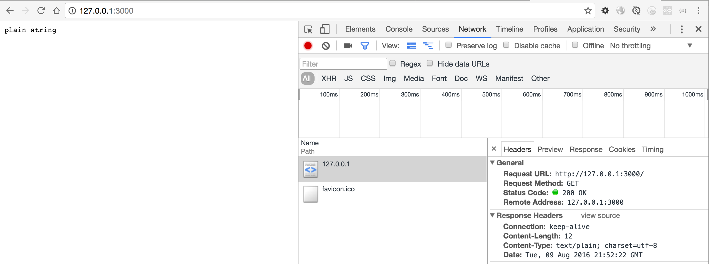
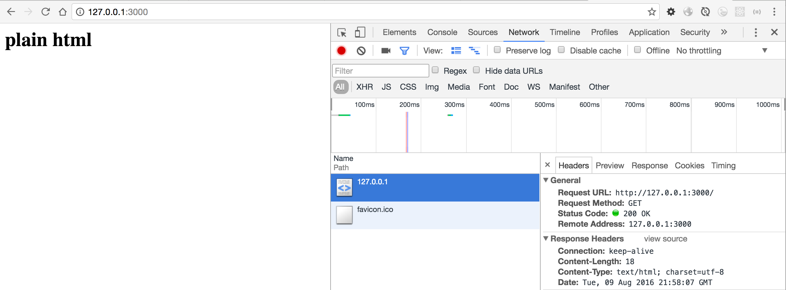
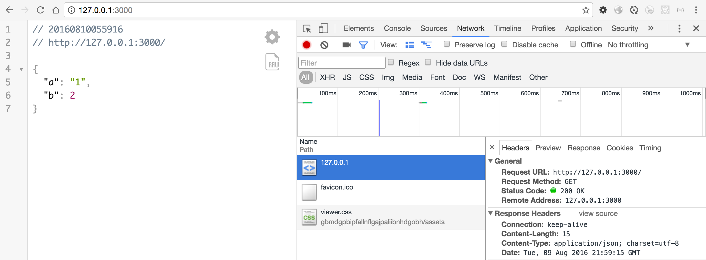
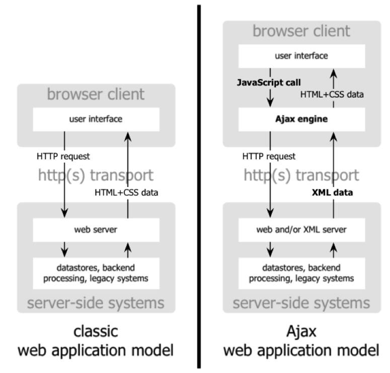

# http实践

- 基础
- 表单传值
- ajax
- upload

# 基础

主要讲解ctx.body和content-type


核心代码处理

https://github.com/koajs/koa/blob/v2.x/lib/response.js#L129


```
 set body(val) {
    const original = this._body;
    this._body = val;

    if (this.res.headersSent) return;

    // no content
    if (null == val) {
      if (!statuses.empty[this.status]) this.status = 204;
      this.remove('Content-Type');
      this.remove('Content-Length');
      this.remove('Transfer-Encoding');
      return;
    }

    // set the status
    if (!this._explicitStatus) this.status = 200;

    // set the content-type only if not yet set
    const setType = !this.header['content-type'];

    // string
    if ('string' == typeof val) {
      if (setType) this.type = /^\s*</.test(val) ? 'html' : 'text';
      this.length = Buffer.byteLength(val);
      return;
    }

    // buffer
    if (Buffer.isBuffer(val)) {
      if (setType) this.type = 'bin';
      this.length = val.length;
      return;
    }

    // stream
    if ('function' == typeof val.pipe) {
      onFinish(this.res, destroy.bind(null, val));
      ensureErrorHandler(val, this.ctx.onerror);

      // overwriting
      if (null != original && original != val) this.remove('Content-Length');

      if (setType) this.type = 'bin';
      return;
    }

    // json
    this.remove('Content-Length');
    this.type = 'json';
  }
```

说明

- HTTP 204(no content)表示响应执行成功，但没有数据返回，浏览器不用刷新，不用导向新页面。
- 默认状态status = 200
- type 根据body具体内容而定
  - string 返回html或text
  - buffer 返回bin
  - function 返回
  - 如果以上都是不是，默认为json，即对象

## content-type

要学习content-type,必须事先知道它到底是什么，是干什么用的。 

HTTP协议（RFC2616）采用了请求/响应模型。客户端向服务器发送一个请求，请求头包含请求的方法、URI、协议版本、以及包含请求修饰符、客户 信息和内容的类似于MIME的消息结构。服务器以一个状态行作为响应，相应的内容包括消息协议的版本，成功或者错误编码加上包含服务器信息、实体元信息以 及可能的实体内容。 

通常HTTP消息由一个起始行，一个或者多个头域，一个只是头域结束的空行和可选的消息体组成。HTTP的头域包括通用头，请求头，响应头和实体头四个部分。每个头域由一个域名，冒号（:）和域值三部分组成。域名是大小写无关的，域 值前可以添加任何数量的空格符，头域可以被扩展为多行，在每行开始处，使用至少一个空格或制表符。 

请求消息和响应消息都可以包含实体信息，实体信息一般由实体头域和实体组成。实体头域包含关于实体的原信息，实体头包括Allow、Content- Base、Content-Encoding、Content-Language、 Content-Length、Content-Location、Content-MD5、Content-Range、Content-Type、 Etag、Expires、Last-Modified、extension-header。 
Content-Type是返回消息中非常重要的内容，表示后面的文档属于什么MIME类型。Content-Type: [type]/[subtype]; parameter。例如最常见的就是text/html，它的意思是说返回的内容是文本类型，这个文本又是HTML格式的。原则上浏览器会根据Content-Type来决定如何显示返回的消息体内容。 

简单点讲：它就是告诉浏览器怎么样解析response内容

### 文本

stuq-koa-examples/koa-practice/http/content-type/string.js 


```
const Koa = require('koa');
const app = new Koa();

// response
app.use(ctx => {
  ctx.body = "plain string"
});

app.listen(3000);
```



注意此时的“Content-Type:text/plain; charset=utf-8”

这种用到的可能性是极其小的，大家了解一下即可

### html


stuq-koa-examples/koa-practice/http/content-type/html.js 

```
const Koa = require('koa');
const app = new Koa();

// response
app.use(ctx => {
  ctx.body = "<h1>plain html<h1>"
});

app.listen(3000);
```



> Content-Type:text/html; charset=utf-8

很明显，返回html就在浏览器里渲染各种html标签，这是我们在浏览器里最常用的做法。所谓的网站等等也都是这样的。

### json对象

```
const Koa = require('koa');
const app = new Koa();

// response
app.use(ctx => {
  ctx.body = {
    "a":"1",
    "b": 2
  }
});

app.listen(3000);
```



> Content-Type:application/json; charset=utf-8

说明

返回json是api或者说前后端分离的常用方式。传输数据的方式一般是xml和json，但由于xml冗余等问题，除了编写web service外，绝大部分我们都会采用json这种轻量级的方式。

目前open api大部分也都是返回json数据的

- http://open.weibo.com/wiki/%E5%BE%AE%E5%8D%9AAPI
- https://developer.github.com/v3/

更多见[客户端 API 开发总结](https://cnodejs.org/topic/552b3b9382388cec50cf6d95)

### 使用模板渲染

我们再想想，如果返回的不是html string，而是模板呢？

模板引擎是一种复用思想，通过定义模板，用的时候和数据一起编译，生成html，以便浏览器渲染。从这个定义里我们可以找出几个关键点

> 编译(模板 + 数据) => html

举例

先来集成[koa-views](https://github.com/queckezz/koa-views)，其核心是[consolidate.js](https://github.com/tj/consolidate.js)，一个支持Node.js里大量模板引擎的库。

```
$ npm i -S koa-views@next
$ npm i -S pug
```

app.js

```
const Koa = require('koa')
const app = new Koa()

const views = require('koa-views')

// Must be used before any router is used
app.use(views(__dirname, { extension: 'pug' }))

// response
app.use(ctx => {
  return ctx.render('user', {
    user: 'John'
  });
})

app.listen(3000)
```

要点1: 引用库文件

```
const views = require('koa-views')
```

要点2: 进行配置

```
// Must be used before any router is used
app.use(views(__dirname, { extension: 'pug' }))
```

要点3：使用ctx.render

```
// response
app.use(ctx => {
  ctx.render('dir/index', {
    a: 1
  })
});
```

- 'dir/index'指的是模板文件位置
- {a:1}是数据

那么render编译后会生成html，讲html string赋值给ctx.body，是不是就可以展示html了？

模板引擎有好多种，下面介绍2种典型的模板引擎

- ejs：嵌入js语法的模板引擎（e = embed），类似于jsp，asp，erb的，在html里嵌入模板特性，如果熟悉html写起来就非常简单，只要区分哪些地方是可变，哪些地方是不变即可
- jade：缩进式极简写法的模板引擎，发展历史 HAML -> Jade -> Slim -> Slm，最早是ruby里有的，目前以jade用的最多，这种写法虽好，，但需要大脑去转换，这其实是比较麻烦的，如果对html不是特别熟悉，这种思维转换是非常难受的。

更多见 

- https://github.com/tj/consolidate.js#supported-template-engines
- https://cnodejs.org/topic/57353cc040b2969853981250

### 总结

所有渲染都无外乎以下2种

- 直接渲染： string 有2种文本和html，衍生出使用模板引擎编译生成html
- 用做api： json object 

其实了解html和koa的模板引擎如何渲染，就已经可以开发网站了。只有api开发，相对高级一点点，一般大些的项目才会使用的。

# 表单传值

上一节我们以表单为例介绍了HTTP请求，那么请求发到服务器了，我么该做什么呢？如何取参数呢？
koa2里的请求参数，都是在ctx.request上，这里主要讲get和post请求。


- ctx.query === ctx.request.query
- ctx.path === ctx.request.path
- ctx.request.body


## ctx.query

这里的query是querystring的别名

说明：ctx.query 不一定是get请求，因为querystring可以存在get或post请求里。

### Koa最简单的获取querystring参数

创建文件 http/query/app.js

```
const Koa = require('koa');
const app = new Koa();

// response
app.use(ctx => {
  ctx.body = 'Hello Koa-' + ctx.query['a'];
});

app.listen(3000);
```

注：ctx.query是ctx.request.query的别名，即ctx.query === ctx.request.query 。

启动服务器

```
$ node query/app.js
```

然后访问`http://127.0.0.1:3000/?a=1`,此时页面显示“Hello Koa-1”，这里的`1`即`ctx.query['a']`

提问

> ctx.query只有get里可以用么？


### 根据ctx.path判断

如果我们想访问`http://127.0.0.1:3000/topic?a=1`呢？

http/query/app-2.js代码

```
const Koa = require('koa');
const app = new Koa();

// response
app.use(ctx => {
  if (ctx.path === '/topic') {
   ctx.body = ' Hello Koa ' + ctx.path + ' a='+ ctx.query['a'];
  }
  
   ctx.body = ' Hello Koa with default path = ' + ctx.path  ;
});

app.listen(3000);
```

启动服务器

```
$ node query/app-2.js
```

访问http://127.0.0.1:3000/topic?a=1

返回` Hello Koa /topic a=1`

如果此时访问`http://127.0.0.1:3000/?a=1`呢？

返回` Hello Koa with default path = /`

###总结一下

- ctx.path 是请求的路径
- ctx.query 获取的querystring
- ctx.body 是返回浏览器页面的文本

以`/topic?a=1`为例

- ctx.path === '/topic'
- ctx.query === '?a=1'

这样便于大家理解path和query的含义。

下面，我们想一下这里处理了2个请求，请求1是`/topic`,请求2是`/topic`以外的其他请求。如果我们再往极限一点想呢？比如有10个、100个请求怎么办？写一个无数个if/else么？

### 关于querystring的几种写法

```
// GET /search?q=tobi+ferret
ctx.query.q
// => "tobi ferret"

// GET /shoes?order=desc&shoe[color]=blue&shoe[type]=converse
ctx.query.order
// => "desc"

ctx.query.shoe.color
// => "blue"

ctx.query.shoe.type
// => "converse"
```

因为有变态的写法

```
// POST /search?q=tobi+ferret
{a:1,b:2}
ctx.query.q
// => "tobi ferret"
```

post里看不到的，用ctx.request.body取。


## ctx.request.body

ctx.request.body一定是post请求，因为get的请求头里没有request.body。并且在koa中没有内置，需要依赖的中间件bodyParser，不然ctx.request.body是没有的。
本章节使用的是koa2，所以需要安装`koa-bodyparser@next`模块

```
npm install koa-bodyparser@next --save
```

包含在请求正文中提交的键值对数据，默认是undefined，当使用body-parsing中间件时ctx.request.body是内置在中间件中的，如 body-parser和multer中间件。

下面例子展示如何使用 body-parsing 中间件里的 ctx.request.body。
注意区分 ctx.body 和ctx.request.body 的区别，它们是完全不同的。

```
const Koa = require('koa');
const bodyParser = require('koa-bodyparser');

const app = new Koa();

app.use(bodyParser());

// response
app.use(ctx => {
  // the parsed body will store in this.request.body
  // if nothing was parsed, body will be an empty object {}
  console.log(ctx.request.body)
  ctx.body = ctx.request.body;
});

app.listen(3000);
```

当我们在浏览器里访问http://127.0.0.1:3000它的时候，是GET请求，此时ctx.request.body默认为空。

所以我们为了能够更清楚看到解析的post请求，所以我们使用chrome的postman插件查看


此时可以看到返回值是

```
{
    "a": "1"
}
```

## ctx.params(暂时不能用)

但可在router中使用：
新建app.js

```
const Koa = require('koa');
const router = require ('koa-router')();
const app = new Koa();

app.use(router.routes())
   .use(router.allowedMethods());

router.get('/user/:id', function (ctx,next){
    ctx.body = 'user ' + ctx.params.id; 
});

app.listen(3000);
```

启动服务器

```
$ node app.js
```

然后访问`http://127.0.0.1:3000/user/:id=10` 会显示`user :id=10`。


## 以html表单的方式测试get和post请求

### get

创建服务器 (http/get/app.js):

```
const Koa = require('koa');
const bodyParser = require ('koa-bodyparser');
const route = require('koa-router')();

const app = new Koa();

app.use(bodyParser());
app.use(require('koa-static')(__dirname + '/public'));

app.use(route.routes())
   .use(route.allowedMethods());
route.get('/topic', function (ctx, next) {
    ctx.body = 'Hello koa' + ctx.query['a'];
    console.log (ctx.query['vehicle']);
});

app.listen(3000);
```

启动服务器

```
$ node get/app.js
```

创建一段html表单代码（http/public/get.html）：

```
<form method="GET" action="/topic">
  <input type="text" name="a" value='1'><br><br>
  <input type="radio" name="sex" value="male">Male<br><br>
  <input type="radio" name="sex" value="female">Female<br><br>
  <input type="checkbox" name="vehicle" value="Bike">I have a bike<br><br>
  <input type="checkbox" name="vehicle" value="Car">I have a car<br><br>
  <input type="submit" value="OK">
</form>
```

访问`http://127.0.0.1:3000/get.html`地址,点击OK按钮,会向'/topic'提交GET请求


在shell中输出

```
Car
```

从上图可以看出，表单里的get数据实际会在url里的querystring里，会显示出来。


### post

创建服务器 (http/post/app.js):

```
const Koa = require('koa');
const bodyParser = require ('koa-bodyparser');
const route = require('koa-router')();

const app = new Koa();

app.use(bodyParser());
app.use(require('koa-static')(__dirname + '/public'));

// routes definition
app.use(route.routes())
   .use(route.allowedMethods());

route.post('/toc/aaa', function (ctx, next) {
    ctx.body = ctx.request.body['a'];
    console.log (ctx.request.body['vehicle']);
});

app.listen(3000);
```

启动服务器

```
$ node post/app.js
```

创建一段html表单代码（http/public/post.html）：

```
<form method="POST" action="/toc/aaa">
  <input type="text" name="a" value='1'><br><br>
  <input type="radio" name="sex" value="male">Male<br><br>
  <input type="radio" name="sex" value="female">Female<br><br>
  <input type="checkbox" name="vehicle" value="Bike">I have a bike<br><br>
  <input type="checkbox" name="vehicle" value="Car">I have a car<br><br>
  <input type="submit" value="OK">
</form>
```

访问`http://127.0.0.1:3000/post.html`地址，会向'/toc/aaa'提交POST请求


点击OK按钮


从上图可以看出，表单里的post数据实际是不会在url里的querystring里。

### 上传

安装中间件

```
$ npm install --save koa-multer
```

Koa中上传基本用法

创建上传文件存储目录：(http/uploads)
创建服务器 (http/app.js)

```
const Koa = require('koa');  // v2
const router = require('koa-router')(); // v6
const multer = require('koa-multer');

const app = new Koa();
const upload = multer({ dest: 'uploads/' });
app.use(require('koa-static')(__dirname + '/public'));
app.use(router.routes())
    .use(router.allowedMethods());

router.post('/profile', upload.single('upfiles'),function (ctx, next){
    ctx.body = "upload is success";
});

app.listen(3000);
```

see more  https://github.com/koa-modules/multer 和 https://github.com/expressjs/multer

启动服务器

```
$ node app.js
```

创建一段html表单代码：(http/public/upload.html)
```
<form method="POST" action="/profile" enctype='multipart/form-data'>
  请选择上传的文件：<input type="file" name="upfiles">
  <input type="submit" value="OK">
</form>
```

访问`http://127.0.0.1:3000/upload.html`地址

选择要上传的文件


上传成功


### 比较一下get和post请求

- get更适合获取、搜索类的请求，url暴露在外面
- post请求适合安全性更改，如创建xx等
- 另外还有一点就是post能处理的表单内容比get要大非常多，后面会讲


# Ajax异步请求

上一节讲了form传值，这是最基本的传值方式。这节我们讲一下我们最常用的ajax传值。
仍然按照我们之前讲过的

- get/post/上传


## 什么是 ajax

Ajax即“Asynchronous Javascript And XML”（异步JavaScript和XML），是指一种创建交互式网页应用的网页开发技术。核心是XMLHttpRequest对象（简称XHR），可以通过使用XHR对象获取到服务器的数据，然后再通过DOM将数据插入到页面中呈现。虽然名字中包含XML，但Ajax通讯与数据格式无关，所以我们的数据格式可以是XML或JSON等格式。

XMLHttpRequest对象用于在后台与服务器交换数据，具体作用如下：

- 在不重新加载页面的情况下更新网页
- 在页面已加载后从服务器请求数据
- 在页面已加载后从服务器接收数据
- 在后台向服务器发送数据

四步

- 通过事件触发ajax请求
- 发送ajax请求
- 处理ajax请求结果，无论成功还是失败
- 处理完成后，根据业务，对页面进行dom操作或css样式操作


### 比较传统表单和ajax异同



TODO: 比较

### 示例helloworld演示 

```
$ cd book-source/http/ajax/helloworld
$ ls
ajax_info.txt index.html
$ hs . -p 9090 -o 
Starting up http-server, serving .
Available on:
  http://127.0.0.1:9090
  http://192.168.1.105:9090
Hit CTRL-C to stop the server
[Thu May 26 2016 22:32:54 GMT+0800 (CST)] "GET /" "Mozilla/5.0 (Macintosh; Intel Mac OS X 10_10_5) AppleWebKit/537.36 (KHTML, like Gecko) Chrome/50.0.2661.102 Safari/537.36"
[Thu May 26 2016 22:32:55 GMT+0800 (CST)] "GET /favicon.ico" "Mozilla/5.0 (Macintosh; Intel Mac OS X 10_10_5) AppleWebKit/537.36 (KHTML, like Gecko) Chrome/50.0.2661.102 Safari/537.36"
[Thu May 26 2016 22:32:55 GMT+0800 (CST)] "GET /favicon.ico" Error (404): "Not found"
```

启动服务器命令说明

- hs 是node模块http-server的简写命令，用于启动http服务器
- `-p 9090`是设置端口的意思
- `-o` 在默认浏览器里打开网址

源码说明

- ajax_info.txt  文本文件，返回一段文字
- index.html    所有的代码

### 源码解析


index.html

```
<!DOCTYPE html>
<html>
  <head>
    <meta charset='uft-8' />
    <title> ajax hello world </title>
  </head>  
<body>
  <div id="demo"><h2>把AJAX返回的数据放到这里</h2></div>
  <button type="button" onclick="send_ajax_request()">改变内容</button>

  <script>
    function send_ajax_request() {
      var xhr = new XMLHttpRequest();
      xhr.onreadystatechange = function() {
        if (xhr.readyState == 4 && xhr.status == 200) {
          // dom
          document.getElementById("demo").innerHTML = xhr.responseText;
          // style
          document.getElementById('demo').style.background = "lightblue";
        }
      };
      xhr.open("GET", "ajax_info.txt", true);
      xhr.send();
    }
  </script>
</body>
</html>

```

四步骤要点

- 通过事件触发ajax请求

给按钮增加onclick事件，在点击的时候调用send_ajax_request()

```
<button type="button" onclick="send_ajax_request()">改变内容</button>
```

- 发送ajax请求（此时是request发送）

```
var xhr = new XMLHttpRequest();
xhr.onreadystatechange = function() {
    if (xhr.readyState == 4 && xhr.status == 200) {
       ...
    }
};
xhr.open("GET", "ajax_info.txt", true);
xhr.send();
```

在创建XHR对象后，接着我们要调用一个初始化方法open()，它接受五个参数具体定义如下：

```
void open(
   DOMString method, //"GET", "POST", "PUT", "DELETE"
   DOMString url,
   optional boolean async,
   optional DOMString user,
   optional DOMString password
);
```

这是完成的ajax请求代码，实际发送请求是通过send方法，即

```
xhr.send();
```

- 处理ajax请求结果，无论成功还是失败（此时是response处理）

```
if (xhr.readyState == 4 && xhr.status == 200) {
          // dom
          document.getElementById("demo").innerHTML = xhr.responseText;
          // style
          document.getElementById('demo').style.background = "lightblue";
        }
```

onreadystatechange 事件

当请求被发送到服务器时，我们需要执行一些基于响应的任务。每当 readyState 改变时，就会触发 onreadystatechange 事件。readyState 属性存有 XMLHttpRequest 的状态信息。

readyState属性 存有 XMLHttpRequest 的状态。从 0 到 4 发生变化（
每个请求发送onreadystatechange 事件就会被触发 5 次（0 - 4），对应着 readyState 的每个变化。）

- 0: 请求未初始化
- 1: 服务器连接已建立
- 2: 请求已接收
- 3: 请求处理中
- 4: 请求已完成，且响应已就绪

status是http状态码，给出常见的几种

- 500 : 'Internal Server Error服务器内部错误',
- 403 : 'Forbidden禁止访问',
- 404 : 'Not Found未找到页面',
- 304 : 'Not Modified没有更改',
- 200 : 'OK',

在 onreadystatechange 事件中，我们规定当服务器响应已做好被处理的准备时所执行的任务。

当 readyState 等于 4 且状态为 200 时，表示响应已就绪，即此时你可以对response返回的数据或文本进行处理。


- 处理完成后，根据业务，对页面进行dom操作或css样式操作

对页面进行dom操作

```
document.getElementById("demo").innerHTML = xhr.responseText;
```

对页面进行css样式操作

```
document.getElementById('demo').style.background = "lightblue";
```

### 问题

- 连续点击【改变内容】按钮，为什么不再改变？
- 为什么刷新会回到之前的内容？

### 这里response(服务器响应)处理的文本，那么用的最多的是什么呢？


如需获得来自服务器的响应，请使用 XMLHttpRequest 对象的 responseText 或 responseXML 属性。

- xhr.responseText	获得字符串形式的响应数据。
- xhr.responseXML	获得 XML 形式的响应数据。

可以任意类型，主要有

- xml（使用xhr.responseXML）
- text文本（xhr.responseText）
- json（xhr.responseText）

虽然ajax里面的x是xml的意思，但实际情况xml用的极其的少，除了web service外，绝大部分情况我们会使用json作为服务端响应数据类型


> 一般讲，api开发（Application Programming Interface）泛指以返回json作为接口的服务端编程。

### 简单的json api示例

```
$ cd book-source/http/ajax/json
$ hs . -p 9091 -o
$ ls
data.json  index.html
```

源码说明

- data.json  文本文件，返回json对象
- index.html    所有的代码

data.json

```
{
  "content": "ajax_info里的数据"
}
```

index.html

```
<!DOCTYPE html>
<html>
  <head>
    <meta charset='uft-8' />
    <title> ajax with json </title>
  </head>  
<body>
  <div id="demo"><h2>把AJAX返回的数据放到这里</h2></div>
  <button type="button" onclick="send_ajax_request()">改变内容</button>

  <script>
    function send_ajax_request() {
      var xhr = new XMLHttpRequest();
      xhr.onreadystatechange = function() {
        if (xhr.readyState == 4 && xhr.status == 200) {
          // json parse
          var data = JSON.parse(xhr.responseText)
          // dom
          document.getElementById("demo").innerHTML = data.content;
          // style
          document.getElementById('demo').style.background = "lightblue";
        }
      };
      xhr.open("GET", "data.json", true);
      xhr.send();
    }
  </script>
</body>
</html>
```

相比较之前的text方式，差异如下

1)请求地址变了，是"data.json"

```
xhr.open("GET", "data.json", true);
```

2）处理完成后，先解析xhr.responseText为json，对页面进行dom操作或css样式操作

```
if (xhr.readyState == 4 && xhr.status == 200) {
    // 先解析xhr.responseText为json
    var data = JSON.parse(xhr.responseText)
    // dom
    document.getElementById("demo").innerHTML = data.content;
    // style
    document.getElementById('demo').style.background = "lightblue";
}
```

其他操作都是一样的。

### ajax与表单

上节讲了表单是用来页面之间传值用的，无论get还是post，它都会跳转到action对应的页面。而ajax是在当前页面就可以完成请求与响应，无需跳转，这是它们之间的差异。它们各自有各自的特点，比如

- 有些页面是需要跳转的，比如登录、注册
- 大部分页面为了有更好的体验，使用ajax，无刷新页面完成请求

那么ajax如何实现和表单一样的传值呢？


### GET 还是 POST？
与 POST 相比，GET 更简单也更快，并且在大部分情况下都能用。

然而，在以下情况中，请使用 POST 请求：

- 无法使用缓存文件（更新服务器上的文件或数据库）
- 向服务器发送大量数据（POST 没有数据量限制）
- 发送包含未知字符的用户输入时，POST 比 GET 更稳定也更可靠

## 写一个接口

使用koa编写这个demo，用到2个模块就够了

1) 第一步`npm init`，会生成package.json文件

2) 安装依赖

```
$ npm i -S koa@next
$ npm i -S koa-static@next
```

在package.json里会自动增加2条依赖

```
"dependencies": {
    "koa": "^2.0.0",
    "koa-static": "^3.0.0"
}
```

3) 创建app.js


```
$ touch app.js
```

在app.js里放入下面代码即可

```
var serve = require('koa-static');
var Koa = require('koa');
var app = new Koa();

// 启用静态httpserver
app.use(serve(__dirname + '/public'));

// 定义json接口
app.use(ctx => {
  if (ctx.path === '/api/json') {
    ctx.body = {
      "content": "ajax_info里的数据"
    }
  } else {
    ctx.body = {
      "error": "请使用 /api/json 作为请求地址"
    }
  }
});

app.listen(3000);

console.log('listening on port 3000');
```

说明

- 启用静态httpserver
- 定义了一个接口

4）启动、测试

```
$ node app.js 
listening on port 3000
```
在浏览器里打开http://127.0.0.1:3000/api/json

返回如下

```
// 20160527073015
// http://127.0.0.1:3000/api/json

{
  "content": "ajax_info里的数据"
}
```

## 加上参数


### get

get请求是通过querystring进行传值

```
if (ctx.path === '/api/get_json_with_param') {
    console.log(ctx.query)
    var name = ctx.query.name
    ctx.body = {
        "content": "ajax_info里的数据",
        "name": name
    }
}
```

http://127.0.0.1:3000/api/get_json_with_param?name=i5ting

### post

koa默认是不支持post请求的，需要使用bodyparser模块

```
npm i -S koa-bodyparser@next
```

修改app.js代码

```
var serve = require('koa-static');
var bodyParser = require('koa-bodyparser');
var Koa = require('koa');
var app = new Koa();

// 处理post请求
app.use(bodyParser());

// 启用静态httpserver
app.use(serve(__dirname + '/public'));
```

下面来看一下post请求代码如何处理

```
if (ctx.path === '/api/post_json_with_param') {
    console.log(ctx.request.body)
    var name = ctx.request.body.name
    ctx.body = {
        "content": "ajax_info里的数据",
        "name": name
    }
}
```

get请求可以在浏览器里显示的测试，而post是不能直接通过url测试的，所以为了简便，我们这里使用chrome的插件postman测试。注意post的类型是x-www-form-urlencoded。


### 总结

至此，我们把koa的get和post返回json api的代码就都讲完了，有了这些api，我们就可以尝试ajax和json api进行联调。

## 联调

### get

点击 【发送get请求】按钮触发get请求

```
<button type="button" onclick="send_get_request()">发送get请求</button>
```

如果您希望通过 GET 方法发送信息，请向 URL 添加信息：

```
function send_get_request() {
    var xhr = new XMLHttpRequest();
    xhr.onreadystatechange = function() {
    if (xhr.readyState == 4 && xhr.status == 200) {
        // json parse
        var data = JSON.parse(xhr.responseText)
        // dom
        document.getElementById("demo").innerHTML = data.content;
        // style
        document.getElementById('demo').style.background = "green";
    }
    };
    xhr.open("GET", "/api/get_json_with_param?name=i5ting", true);
    xhr.send();
}
```   

### post

点击 【发送post请求】按钮触发post请求

```
<button type="button" onclick="send_post_request()">发送post请求</button>
```

如果需要像 HTML 表单那样 POST 数据，请使用 setRequestHeader() 来添加 HTTP 头。然后在 send() 方法中规定您希望发送的数据：

```
function send_post_request() {
    var xhr = new XMLHttpRequest();
    xhr.onreadystatechange = function() {
      if (xhr.readyState == 4 && xhr.status == 200) {
        // json parse
        var data = JSON.parse(xhr.responseText)
        // dom
        document.getElementById("demo").innerHTML = data.content;
        // style
        document.getElementById('demo').style.background = "red";
      }
    };
    xhr.open("POST", "/api/post_json_with_param", true);
    xhr.setRequestHeader("Content-type","application/x-www-form-urlencoded");
    xhr.send("name=i5ting");
}
```

### demo

http://127.0.0.1:3000/test.html

## 表单取值

此时我们的请求还是没有任何输入的，因为我们都给固定死了，这其实是为了演示方便，但绝大部分情况是不会这样的，都有正常的输入。

结合我们讲的ajax流程的4个步骤，想想，如果动态取表单里的值，然后ajax，应该是什么样的流程？

ajax完整5步骤

- 通过事件触发ajax请求
- 通过dom获取表单数据值
- 组装表单数据值，发送ajax请求
- 处理ajax请求结果，无论成功还是失败
- 处理完成后，根据业务，对页面进行dom操作或css样式操作

这里以get请求举例

```
function send_get_request() {
      var xhr = new XMLHttpRequest();
      xhr.onreadystatechange = function() {
        if (xhr.readyState == 4 && xhr.status == 200) {
          // json parse
          var data = JSON.parse(xhr.responseText)
          // dom
          document.getElementById("demo").innerHTML = "get返回的结果" + data.name;
          // style
          document.getElementById('demo').style.background = "green";
        }
      };
      var myname = document.getElementById("myname").value
      xhr.open("GET", "/api/get_json_with_param?name=" + myname, true);
      xhr.send();
}   
```

说明

1）dom获取表单数据

```
var myname = document.getElementById("myname").value
```

2) 组装ajax要传送的表单数据

```
xhr.open("GET", "/api/get_json_with_param?name=" + myname, true);
```

这里是get，所以在querystring里组装

如果是post

```
function send_post_request() {
      var xhr = new XMLHttpRequest();
      xhr.onreadystatechange = function() {
        if (xhr.readyState == 4 && xhr.status == 200) {
          // json parse
          var data = JSON.parse(xhr.responseText)
          // dom
          document.getElementById("demo").innerHTML = "post返回的结果" + data.name;
          // style
          document.getElementById('demo').style.background = "red";
        }
      };
      xhr.open("POST", "/api/post_json_with_param", true);
      xhr.setRequestHeader("Content-type","application/x-www-form-urlencoded");
      var myname = document.getElementById("myname").value
      xhr.send("name=" + myname);
}
```

1) 需要设置xhr.setRequestHeader

```
xhr.setRequestHeader("Content-type","application/x-www-form-urlencoded");
```

2）表单传值不在querystring，而是直接放到send方法里，写法和querystring一样。

```
xhr.send("name=" + myname);
```

例子book-source/http/ajax/koa-json/public/test.html ，请访问 http://127.0.0.1:3000/form.html

## jQuery ajax

通过 jQuery AJAX 方法，您能够使用 HTTP Get 和 HTTP Post 从远程服务器上请求文本、HTML、XML 或 JSON - 同时您能够把这些外部数据直接载入网页的被选元素中。
如果没有 jQuery，AJAX 编程还是有些难度的。
编写常规的 AJAX 代码并不容易，因为不同的浏览器对 AJAX 的实现并不相同。这意味着您必须编写额外的代码对浏览器进行测试。不过，jQuery 团队为我们解决了这个难题，我们只需要一行简单的代码，就可以实现 AJAX 功能。

在使用Ajax前，需要下载jQuery库，并在页面中引入`<script src="jquery.js"></script>`。

我们这里使用最多的jQuery库举例

```
$.get("test.cgi", { name: "John", time: "2pm" }, function( data ) {
    // 处理ajax请求结果
    alert( "Data Loaded: " + data );
    // 根据业务，对页面进行dom操作或css样式操作
    $(sss).html().css()
});
```

- 使用$.get或$.post发送ajax请求。可以理解它是对原生的xhr封装
- 在回调中`function( data ) {}`里处理ajax请求结果
- `$(sss).html().css()`对页面进行dom操作或css样式操作

https://github.com/DevMountain/mini-ajax


jQuery Ajax使用方法与 Ajax 相似，写接口、创建服务器、启动服务器，与Ajax相同，这里不再重复。

给出app.js 源码

```
var koa = require ('koa');
var serve = require ('koa-static');
var bodyParser = require ('koa-bodyparser');

var app = new koa();

app.use (bodyParser());
app.use (serve(__dirname + '/public'));
app.use ( ctx => {
    if(ctx.path === '/api/get_json_with_param'){
        console.log(ctx.query);
        var name = ctx.query.name;
        ctx.body = {
            "content":"ajax_info里的数据",
            "name": name
        }
    } else if (ctx.path === '/api/post_json_with_param') {
        console.log(ctx.request.body)
        var name = ctx.request.body.name
        ctx.body = {
            "content": "post_json_with_param里的数据",
            "name": name
        }
    } else {
        ctx.body = {
            "error":"请使用 /api/json 作为请求地址"
        }
    }
});

app.listen(3000);

console.log ("listening on port 3000");
```

启动服务器

```
$node app.js
```
以表单为例，介绍如何使用$.get或$.post发送ajax请求

同样5步骤

- 通过事件触发ajax请求
- 通过dom获取表单数据值
- 组装表单数据值，发送ajax请求
- 处理ajax请求结果，无论成功还是失败
- 处理完成后，根据业务，对页面进行dom操作或css样式操作


引入jQuery 库
```
<head>
    <meta charset='uft-8' />
    <title> ajax with json </title>
    <script src="/script/jquery.js"></script>
</head> 
```

### get

$.get(url,[data],[callback])

- url (String) 发送请求的URL地址.
- data (Map)(可选参数) 要发送给服务器的数据，以 Key/value 的键值对形式表示，会做为QueryString附加到请求URL中
- callback (Callback) (可选参数) 载入成功时回调函数(只有当Response的返回状态是success才是调用该方法)，该函数接受两个参数，第一个为服务器返回的数据，第二个参数为服务器的状态。

```
  <form> 
    <input type='text' name='username' value='i5ting' id='myname'/>
    <div id="demo"><h2>把AJAX返回的数据放到这里</h2></div>
    <button id="bt1" type="button">发送get请求</button>
    <button id="bt2" type="button">发送post请求</button>
  </form>
  <script>
      $('#bt1').click( function () {  // 触发ajax请求
          var name1 = $("#myname").val(); // 获取表单数据值
            console.log(name1);  // 打印取到的表单值
            $.get ('/api/get_json_with_param', {name:name1}, function (data,status) {
            // function (data,staus)中，data为服务器返回数据，status为服务器状态
             
            $('#demo').html("get返回的结果" + data.name).css('background','lightblue');
            console.log (data); // 打印返回数据
         });
       });
  </script>
```

### post

$.post(url,[data],[callback],[type])

这个函数跟$.get()参数差不多。
- url (String) 发送请求的URL地址.
- data (Map)(可选参数) 要发送给服务器的数据，以 Key/value 的键值对形式表示
- callback (Callback) (可选参数) 载入成功时回调函数(只有当Response的返回状态是success才是调用该方法)
- type (String) (可选参数) 请求数据的类型，xml,text,json等,如果我们设置这个参数为：json，那么返回的格式则是json格式的，如果没有设置，就 和$.get()返回的格式一样，都是字符串的

```
  <form> 
    <input type='text' name='username' value='i5ting' id='myname'/>
    <div id="demo"><h2>把AJAX返回的数据放到这里</h2></div>
    <button id="bt1" type="button">发送get请求</button>
    <button id="bt2" type="button">发送post请求</button>
  </form>
  <script>
    $('#bt2').click( function () {
       var name1 = $("#myname").val();
       console.log(name1);
       $.post ('/api/post_json_with_param', {name:name1},function (data,status) {
          $('#demo').html("post返回的结果" + data.name).css('background','red');
          console.log (data); // 打印返回数据
      });
    });
  </script>
```
### upload

要实现上传功能，需要借助插件。
推荐[koa-uploadify](https://github.com/i5ting/uploadify/tree/revert-2-koa-uploadify)
https://github.com/i5ting/uploadify/tree/revert-2-koa-uploadify
可以把源码下载下来研究一下。

## 总结

使用jQuery Ajax 相对简单，易于理解，而且它要小好多。
