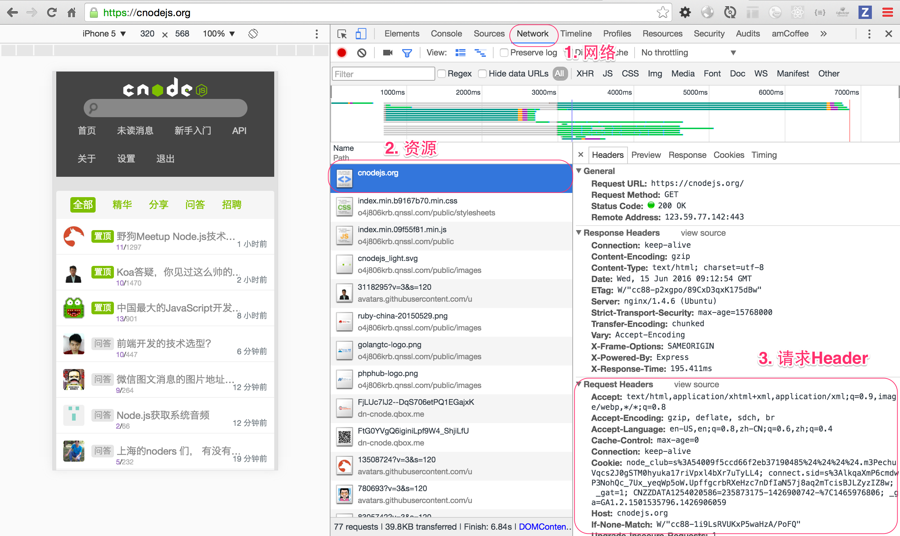
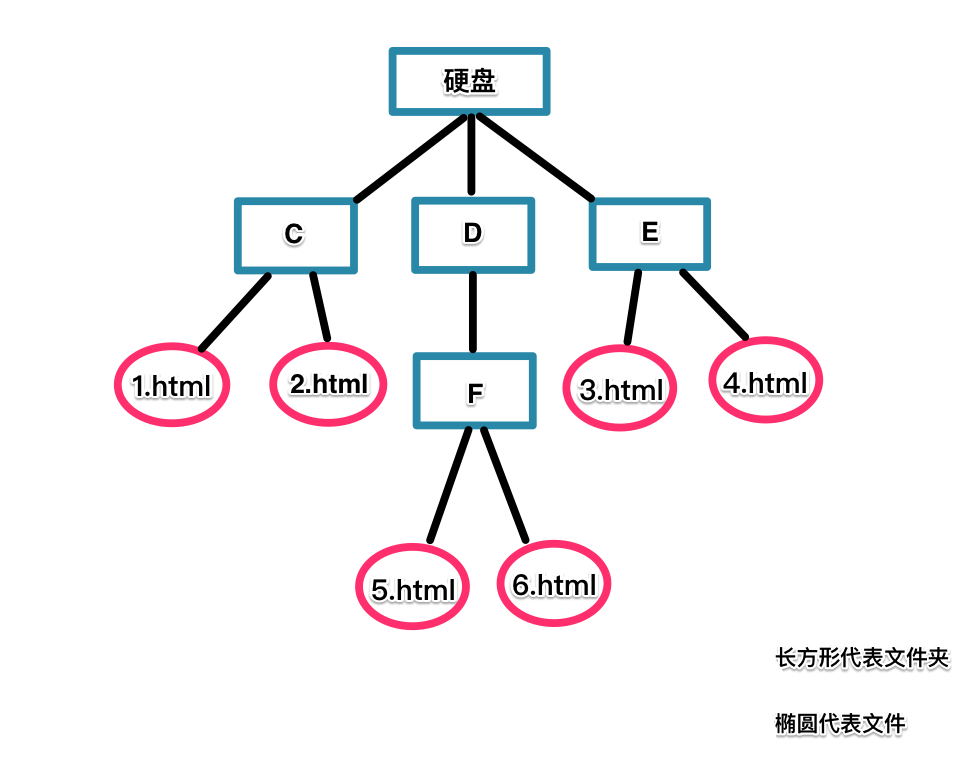

# http


超文本传输协议（英文：HyperText Transfer Protocol，缩写：HTTP）是互联网上应用最为广泛的一种网络协议。设计HTTP最初的目的是为了提供一种发布和接收HTML页面的方法。通过HTTP或者HTTPS协议请求的资源由统一资源标识符（Uniform Resource Identifiers，URI）来标识。

HTTP的发展是万维网协会（World Wide Web Consortium，W3C）和互联网工程任务组（Internet Engineering Task Force，IETF）合作的结果，（他们）最终发布了一系列的RFC，其中最著名的是1999年6月公布的 RFC 2616，定义了HTTP协议中现今广泛使用的一个版本——HTTP 1.1。

2014年12月互联网工程任务组（IETF）的Hypertext Transfer Protocol Bis（httpbis）工作小组将HTTP/2标准提议递交至IESG进行讨论[1]，于2015年2月17日被批准。[2] HTTP/2标准于2015年5月以RFC 7540正式发表，替换HTTP 1.1成为HTTP的实现标准。[3]

## 协议概述

HTTP是一个客户端终端（用户）和服务器端（网站）请求和应答的标准（TCP）。通过使用Web浏览器、网络爬虫或者其它的工具，客户端发起一个HTTP请求到服务器上指定端口（默认端口为80）。我们称这个客户端为用户代理程序（user agent）。应答的服务器上存储着一些资源，比如HTML文件和图像。我们称这个应答服务器为源服务器（origin server）。在用户代理和源服务器中间可能存在多个“中间层”，比如代理服务器、网关或者隧道（tunnel）。

尽管TCP/IP协议是互联网上最流行的应用，HTTP协议中，并没有规定必须使用它或它支持的层。事实上，HTTP可以在任何互联网协议上，或其他网络上实现。HTTP假定其下层协议提供可靠的传输。因此，任何能够提供这种保证的协议都可以被其使用。因此也就是其在TCP/IP协议族使用TCP作为其传输层。

通常，由HTTP客户端发起一个请求，创建一个到服务器指定端口（默认是80端口）的TCP连接。HTTP服务器则在那个端口监听客户端的请求。一旦收到请求，服务器会向客户端返回一个状态，比如"HTTP/1.1 200 OK"，以及返回的内容，如请求的文件、错误消息、或者其它信息。

## 请求信息（Request Message）

发出的请求信息包括以下几个

- 请求行
  - 例如GET /images/logo.gif HTTP/1.1，表示从/images目录下请求logo.gif这个文件。
-（请求）头，
  - 例如Accept-Language: en
- 空行
- 其他消息体

请求行和标题必须以<CR><LF>作为结尾。空行内必须只有<CR><LF>而无其他空格。在HTTP/1.1协议中，所有的请求头，除Host外，都是可选的。

当我们在地址栏输入https://cnodejs.org/时，浏览器将显示cnode的首页。在这个过程中，浏览器都干了哪些事情呢？通过Network的记录，我们就可以知道，在Network中，定位到第一条记录，点击，右侧将显示Request Headers，点击右侧的view source，我们就可以看到浏览器发给cnode服务器的请求：




## URL

URL，是uniform resource locator，统一资源定位器，它可以用来标识一个资源，指明了如何定位这个资源。通俗点说，web上有大量的资源，如何找到所需资源呢，这就要靠URL来定位。

URL用一种统一的格式来描述各种信息资源，包括文件、服务器的地址和目录等。
URL一般由三部组成:
1. 协议(或称为服务方式) 例如：http://
2. 存有该资源的主机IP地址(有时也包括端口号)或服务器域名  例如：127.0.0.1:3000 和 www.baidu.com
3. 主机资源的具体地址。如目录和文件名等，/photo/1.jpg

这是一个完整的URL实例：
http://www.runoob.com/nodejs/nodejs-url.html


## 绝对地址和相对地址

http://jingyan.baidu.com/article/9225544683537d851648f4e0.html

有一个如 图2-1 所示的文件系统结构
图2-1   
通过这个为大家解释相对地址和绝对地址。

- 相对地址的定义：

被链接文件相对于当前页面的地址。
只包含本地路径的网页地址，地址通常以“./”和“../”表示表示本级目录和上一级目录。
例如图2-1，假设5.html为当前页面，那个6.html的相对地址为: ./6html，2.html的相对地址为： ../../C/2.html 。
总之，相对地址是指从当前网页所在的文件夹开始的网页地址。

在编写网页时，大多数情况下使用的是相对地址。好处是将整个网站复制到任何位置，都不需要重新调整地址。

- 绝对地址的定义：

绝对地址就是文件在网络或本地的绝对位置。绝对，具有唯一性，如官网地址。绝对地址是互联网上的独立地址，在任何网站通过这个地址可以直接到达目标网页。包含主域名和目录地址。其中网络地址就是以http://、 ftp://或 https:// 等网络协议名开头的地址。本地址址是就在本地计算机外存储器（硬盘、软件、U盘等）上的地址，以"/"开始。如：/c:\public\1.html；/public\1.html等，其中“/c:\public\ 1.html”是指C盘下public文件夹中的 1.html页面。而“/public\ 1.html”是指当前窗页所在分区的根目录下public文件夹中的 1.html页面。假设当前网页在D盘，不论是在D盘的什么文件夹下，也不设是在第几层文件夹下，这个地址指的都是D盘下public文件夹中的 1.html页面。
例如图2-1，3.html的绝对地址为： /硬盘:\E\3.html (硬盘代表一个盘符)。5.html的绝对地址为： /硬盘:\D\F\5.html


## querystring

querystring是node.js原生自带,直接 require('querystring') 即可使用。

此类一共包括4个方法:

- querystring.stringify(obj, [sep], [eq]) 对象格式化成字符串
- querystring.parse(str, [sep], [eq], [options]) 字符串解析成对象
- querystring.escape（） 参数编码
- querystring.unescape（） 参数解码

[options]表示可选参数, [sep]指分隔符 默认& , [eq]指分配符 默认=

### querystring.stringify(obj,[sep],[eq])

把对象格式化成参数字符串 ,obj 是要格式化的对象,必选参数.
```
var obj={name:"i5ting",url:"https://github.com/i5ting"};
var param= querystring.stringify(obj); //没有指定分隔符和分配符,并且自动编码汉字和一些符号
console.log(param);
```
输出结果：
```
name=i5ting&url=https%3A%2F%2Fgithub.com%2Fi5ting
```
指定了分隔符和分配符
```
param=querystring.stringify(obj,'|','*'); 
console.log(param);
```
输出结果：
```
name*i5ting|url*https%3A%2F%2Fgithub.com%2Fi5ting
```

### querystring.parse(str, [sep], [eq], [options]) 

参数字符串格式化成对象
```
var obj={name:"i5ting",url:"https://github.com/i5ting"};
var param= querystring.stringify(obj);
```
我们把param 字符串格式化成对象,使用默认分隔分配符
```
var newobj=querystring.parse(param);
console.log(typeof newobj,newobj); //打印出来格式化后的数据类型 和 内容.
```
输出结果：
```
object { name: 'i5ting', url: 'https://github.com/i5ting' }
```

可以看到格式化以后是object类型,并且`//`自动解码显示出来.

### querystring.escape

参数编码
```
var param=querystring.escape("i5ting爱你")
console.log(param);
```
输出结果：
```
i5ting%E7%88%B1%E4%BD%A0
```

### querystring.unescape	

参数解码
```
var param="i5ting&http://github.com/i5ting";
var es = querystring.escape(param)
console.log(es);
console.log(querystring.unescape(es));
```
先编码再解码    
输出结果：
```
i5ting%26http%3A%2F%2Fgithub.com%2Fi5ting
i5ting&http://github.com/i5ting
```

## http status code


当浏览者访问一个网页时，浏览者的浏览器会向网页所在服务器发出请求。当浏览器接收并显示网页前，此网页所在的服务器会返回一个包含HTTP状态码的信息头（server header）用以响应浏览器的请求。
HTTP状态码的英文为HTTP Status Code。
下面是常见的HTTP状态码：

-  500 : 'Internal Server Error',
-  403 : 'Forbidden',
-  404 : 'Not Found',
-  304 : 'Not Modified',
-  200 : 'OK',

还有很多，可参考http://www.restapitutorial.com/httpstatuscodes.html

https://github.com/nodejs/io.js/blob/master/lib/_http_server.js
