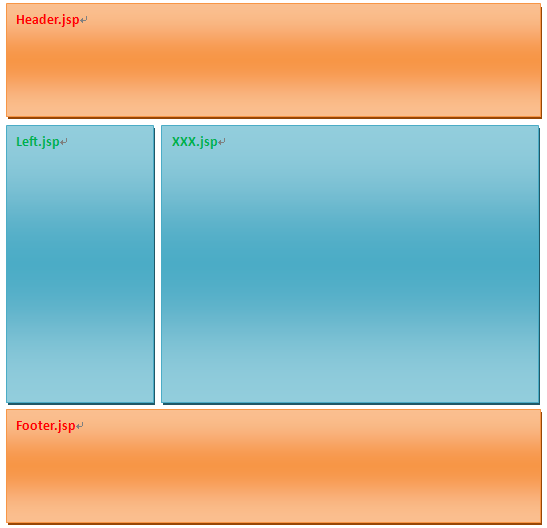

jade模板引擎
==========

Jade是一款高性能简洁易懂的模板引擎，Jade是Haml的Javascript实现，在服务端（NodeJS）及客户端均有支持。

官网 http://jade-lang.com/

习惯jade的最好办法：找一个已写好的html代码，用jade重写一遍

但是如果你是新手，而且直接拿jade写没有写过的页面，那么你会死的很难看

## 规则说明

### 标签简写

	比如`<p>`写成`p`
	
jade里的

	p
	
等于

	<p></p>

### 属性放到括号里

	比如`<div class='left_panel'>`写成`div`

#### 标签只有1个属性的情况

jade里的
	
	div(class='left_panel')
	
等于

	<div class='left_panel'>
	
#### 标签如果有多个属性的情况


jade里的

	div(id='this_is_div_id',class='left_panel')
	
等于

	<div id='this_is_div_id' class='left_panel'>
	
	
### value写法

比如html代码
	
	<p>this is a p tag</p>
	
在jade里需要成

	p this is a p tag
	
一定要注意`p`标签后面的空格，如果没有空格是错的

但是如果标签有括号属性的，可以没有空格

	button(id='create_exam_on_server_btn')生成问卷

建议：不管有没有标签，都要再写value的时候加一个空格

### 没有空行

jade里不允许有空行，比如我们在html里可以写的很随意

	<p>前端专业八级考试</p>
	
	<p>友情提示：不准携带通讯工具，不准交头接耳、 一经发现，取消考试成绩，并终生禁止再次参与本考试！一定要记得哦！</p>

但是在jade里，是不允许出现空行，你只能这样写

	p 前端专业八级考试
	p 友情提示：不准携带通讯工具，不准交头接耳、 一经发现，取消考试成绩，并终生禁止再次参与本考试！一定要记得哦！

好处是代码不能太随意，因为编译不通过，jade其实是把空行当做编译一个标签的条件，所以你只能遵守规则玩


### 层级嵌套

比如我们常见的html代码

	<ul id='all_qs'>
		<li>1</li>
		<li>2</li>
		<li>3</li>
	</ul>
	
在jade里需要成

	ul(id='all_qs')
		li 1
		li 2
		li 3

这个实现原理很简单，就是利用缩进来判断包含关系。

缩进有2种方式

1. 空格
2. tab（推荐使用tab）

### 变量

```
doctype html
html
  head
    title= title
    link(rel='stylesheet', href='/stylesheets/style.css')
    script(src='/javascripts/jquery.min.js')
  body
    block content
```

这里的`title= title`代码里的`=`代表后面接的是变量。而且在子页面通过extends继承的也可以使用该变量。


### 插写法

	p #user #{name} #{email}
	
  
这种是和ruby的语法一样的
	
### 反转义变量!{html}

	var html = "<script></script>"

	!{html}
	
### 注释

#### 块注释

	body
		//
		#content
			h1 CSSer,关注Web前端技术

#### 条件注释

	body
	/if IE
	    a(href='http://www.mozilla.com/en-US/firefox/') Get Firefox

### 块扩展

块扩展允许创建单行的简洁嵌套标记，下面的示例与上例输出相同：

  ul
    li.first: a(href='#') foo
    li: a(href='#') bar
    li.last: a(href='#') baz
		
		
		
## 布局

这里引一个java里的sitemesh布局框架



这个其实和jade的布局概念差不多，装饰模式不见得比编译更有优势

布局最核心的是留空，其他的都放到layout里，复用layout。。。

下面具体看看

layout.jade

```
doctype html
html
	head
		title= title
		link(rel='stylesheet', href='/stylesheets/survey.css')
		script(src='/javascripts/jquery.min.js')
		script(src='/javascripts/jquery.min.js')
		script(src='/javascripts/survey.js')
	body
		div(class='left')
			block left_content
		div(class='main')
			block main_content
```		

集成

```
extends ../layout

block left_content
	h1= title
	button(id='create_exam_on_server_btn')生成问卷
	hr 
	p all 题目
	ul(id='all_qs')

block main_content
	h1= title
	div(class='create_exam')
		select(name='is_ad')
			option(value='true') true
			option(value='false',selected) false
		br
		input(type='text' name='all_name' value='前端技术专业八级考试')
		br
		input(type='text' name='all_desc' value='友情提示：不准携带通讯工具，不准交头接耳、 一经发现，取消考试成绩，并终生禁止再次参与本考试！一定要记得哦！')
		br
		input(type='text' name='all_weixin_name' value='all_weixin_name')
		br
		input(type='text' name='all_weixin_id' value='188888888')
		button(id='create_exam_btn')创建试卷
	div(class='show_exam')
		p 前端专业八级考试
		p 友情提示：不准携带通讯工具，不准交头接耳、 一经发现，取消考试成绩，并终生禁止再次参与本考试！一定要记得哦！
```

说明

- extends是指当前jade页面继承自哪个layout
- block是指定义此处有模板块

这个是最最核心的概念，也是最最实用的~~

结合include就是神器~~

### each

首先服务器端要返回数据

```
router.get('/list', function(req, res) {
	var Survey = req.models.Survey;
	Survey.find_list({},function(surveys){
		res.render('survey/list', { title: '试卷列表',surveys: surveys });
	});
});
```

然后jade中

```
		ul
			each item in surveys
				li= item.name
					a(href= item.static_page_name)= item.name
```

注意等号

- li= item.name（无属性直接赋值变量）
- a(href= item.static_page_name)= item.name（有属性，赋值变量）


## include

在ruby里叫partial

可以把很多公用的部分，拆成partial

include分2种

- 静态文件
- 带data参数的


### 静态文件

```
include ./includes/head.jade
```

### 带data参数的

```
include activity
```

它会把上下文的 activity 作为数据参数，传给

```
- var _action = activity._action == 'edit' ? '#' : '/activities/'
- var _method = activity._action == 'edit' ? ""  : "post"
- var _type   = activity._action == 'edit' ? "button"  : "submit"
- var onClick  = activity._action == 'edit' ?  "click_edit('activity-" + activity._action + "-form','/activities/" + activity._id + "/')" : ""
form(id='activity-#{ activity._action}-form',action="#{_action}", method="#{_method}",role='form')
  each n in ['activity.title','activity.product_name','activity.product_count','activity.price','activity.detail','activity.expire_days','activity.start_date','activity.end_date','activity.owner_id','activity.created_at']
    - m = eval(n);
    div(class="field")
      label #{n.split('.')[1]} #{m}
      br
      input(type='text',name="#{n.split('.')[1]}" ,value="#{ m == undefined ? '' : m }")
        
  div(class="actions") 
    input(type='#{_type}',value='Submit',onClick='#{onClick}')
```

## 内嵌script

在html里直接使用script写代码，虽然不推荐，但偶尔还是会用的的

比如weui里的模板

```
script.
  function test(){
    console.log('xxxx');
  }
```

注意script后面的`.`

## 最佳实践


jade效率基准测试&预编译&nodejs工作流

我想出的满足当下场景下需求(在使用了预编译的同时实现实时刷新)的办法是: nodejs中fs.watch监控jade文件进行re-compile + gulp中watch文件然后延时触发lr.changed().

## 示例

```
// Let's first see how to inject JS logic into your JADE templates
// JADE supports its own constructs for conditionals and loops to make your templates cleaner :) Let's see it in action!

- var users = [{name: 'foo', role: 'admin'}, {name: 'bar', role: 'manager'}, {name: 'baz', role: 'technician'}]

h2 Users

// Neat! There's another construct called `each`
// Also there is `unless` which is equivalent to if (!expr)
// Let's use that and swap a bit of code

each user, index in users
	unless user.role === 'admin'
		p #{user.name} is not an "admin"
	else
		p #{user.name} is an "admin"

// Let's take a look at `case` statements now

h3 case

case users[2].name
	when 'admin'
		p User is an admin
	when 'manager'
		p User is a manager
	when 'technician'
		p User is a technician
	default
		p User is a customer!

h3 mixins

// mixins are pieces of code that you can reuse as functions. they may or may not accept arguments

mixin fruits
	ul
		li Apple
		li Banana
		li Orange

h2 Fruits
mixin fruits

mixin users(name, role)
	li(attributes) #{name} has a role of #{role}

// Another way to call mixins that provides with a few extra features that you're going to see in a second.
// The attributes, id, class have been added to the li's. You can style them from CSS now.

+users(users[0].name, users[0].role)#admin
+users(users[1].name, users[1].role).manager
+users(users[2].name, users[2].role)(title="technician")

// Mixins are excellent for dropdowns

mixin user_list(name)
	option(value="#{name}") #{name}

select
	for user in users
		+user_list(user.name)

// Great! Now finally let's take a look at "filters". filters must be prefixed with ':', for example ':coffeescript' or ':markdown'. Jade currently supports :stylus, :less, :markdown, :cdata and :coffeescript. Let's see how to use the coffee filter.

:coffeescript
	(->
		document.querySelectorAll('.manager')[0].style.color = 'blue'
	)()

// Some random piece of code but you get the idea :)
// That's all!

```

## 总结

- 使用tab而非space
- 不管有没有属性，标签和value之间都要有空格
- 利用layout定义布局模板
- 利用include来引用公共模块
- 预编译，提高模板执行效率
- livereload，提高开发效率


- http://paularmstrong.github.io/node-templates/
- Jade模板引擎入门教程http://www.cnblogs.com/fullhouse/archive/2011/07/18/2109945.html
- https://github.com/jadejs/jade/blob/master/Readme_zh-cn.md
